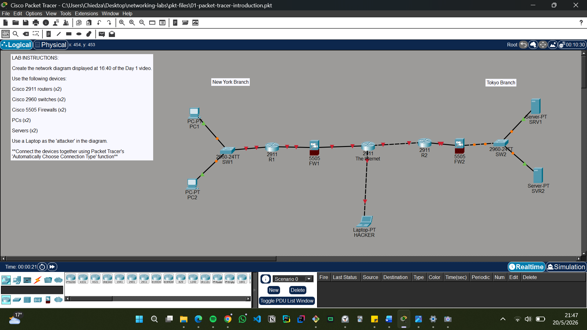

# Lab 01 – Packet Tracer Introduction

## Objective
Learn the basics of Cisco Packet Tracer and understand the workspace and interface.

---

## Activities
- Explored the Packet Tracer interface
- Identified networking devices
- Practiced basic topology setup

---

## Screenshot

---

## 📁 Files
- 01-packet-tracer-introduction.pkt

---

## 📚 Learning Outcome
- Understanding Packet Tracer environment
- Introduction to network simulation tools
